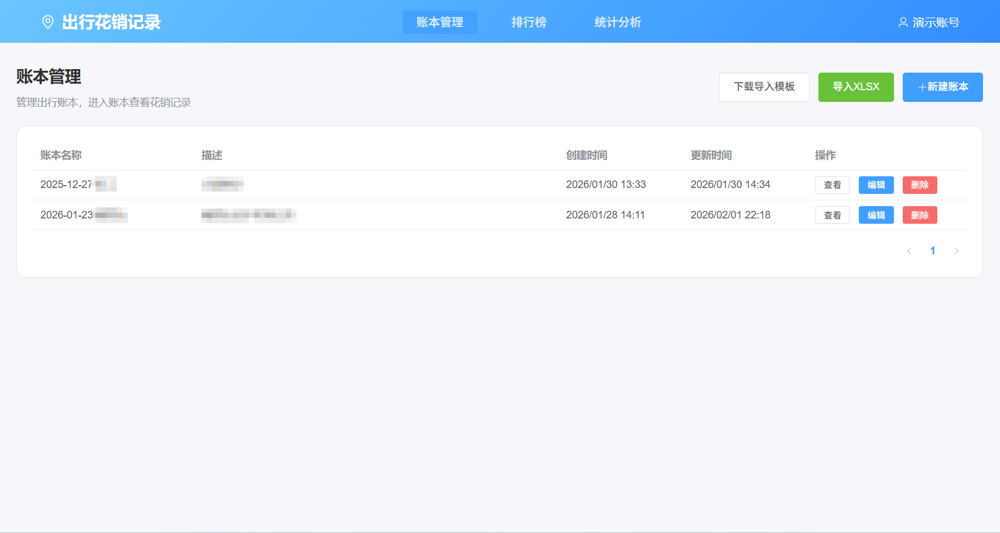
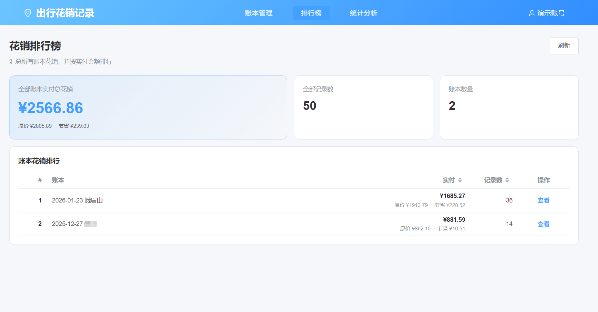
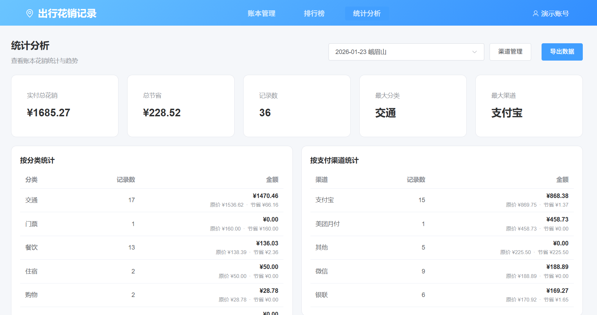
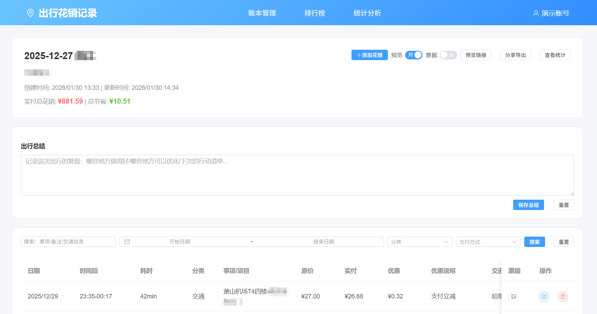

# 出行花销记录

一个用于记录与统计出行相关花销的 Web 应用：支持账本管理、花销明细、统计分析、XLSX 导入/导出、账本预览分享、票据附件上传与预览等能力。

## 功能概览

- 用户注册/登录（JWT）
- 出行账本：创建、编辑、删除、详情查看
- 花销明细：按日期/时间段记录，支持筛选、分页、编辑、删除
- 统计分析：分类/渠道统计、每日趋势、全账本花销排行榜
- 数据导入/导出：XLSX 模板下载、导入、按账本导出
- 账本预览分享：生成预览链接（支持有效期与“是否展示票据”开关）
- 票据附件：图片上传/列表/删除/预览

## 项目预览






## 技术栈

- 前端：Vue 3 + Vite + Element Plus + Axios
- 后端：Node.js + Express
- 数据库：SQLite（启动时自动初始化表结构并执行迁移）
- 认证：JWT（Bearer Token）

## 目录结构

```text
travel_record/
  backend/                 后端 API（Express）
  frontend/                前端 SPA（Vue 3 + Vite）
  说明文档.md               项目规划/实施/进度记录
```

## 快速开始（开发）

### 前置条件

- Node.js 18+（建议）
- npm

### 1) 启动后端

```bash
cd backend
npm install
npm run dev
```

- 后端默认端口：`9505`
- 健康检查：`http://localhost:9505/api/health`
- 后端会在启动时自动创建/初始化数据库：`backend/database/travel_expense.db`

### 2) 启动前端

```bash
cd frontend
npm install
npm run dev
```

- 前端默认端口：`9005`
- 本地访问：`http://localhost:9005`
- 开发时已配置代理：前端请求 `/api/*` 会转发到 `http://127.0.0.1:9505`

## 构建与部署（参考）

### 前端构建

```bash
cd frontend
npm install
npm run build
```

构建产物在 `frontend/dist/`，可用任意静态服务器部署。

### 后端启动

```bash
cd backend
npm install
npm start
```

生产环境务必设置强随机的 `JWT_SECRET`（见下文配置）。

## 配置说明

后端使用 `backend/.env`：

```dotenv
PORT=9505
JWT_SECRET=your-super-secret-jwt-key-here
NODE_ENV=development
DB_PATH=./database/travel_expense.db
```

- `PORT`：后端端口（默认 `9505`）
- `JWT_SECRET`：JWT 签名密钥（生产环境必须替换）
- `NODE_ENV`：环境标识
- `DB_PATH`：当前代码中数据库路径固定为 `backend/database/travel_expense.db`，此字段暂未被读取

附件文件默认保存目录：

- `backend/uploads/expense_attachments/`
